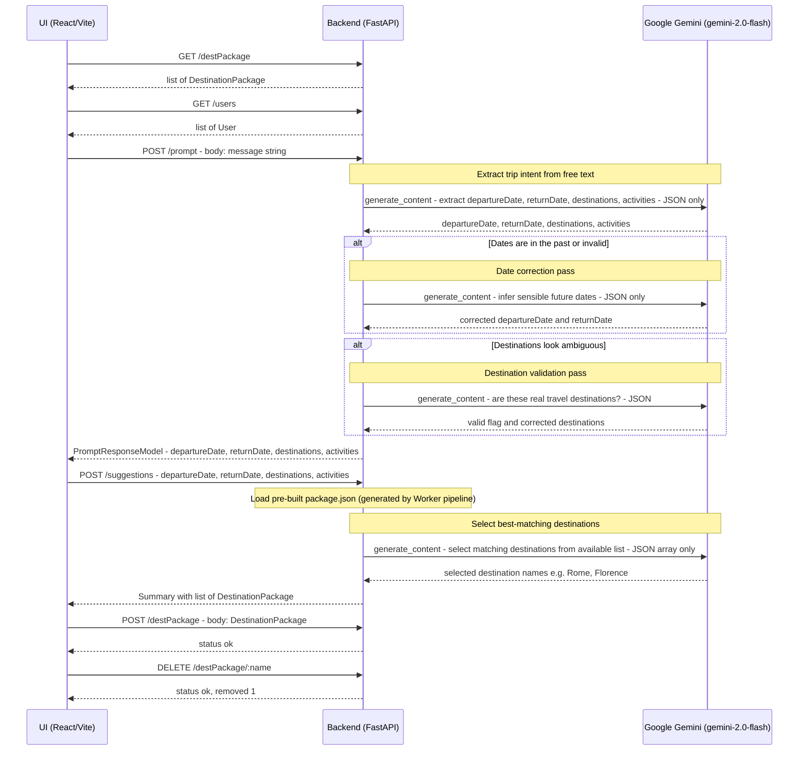
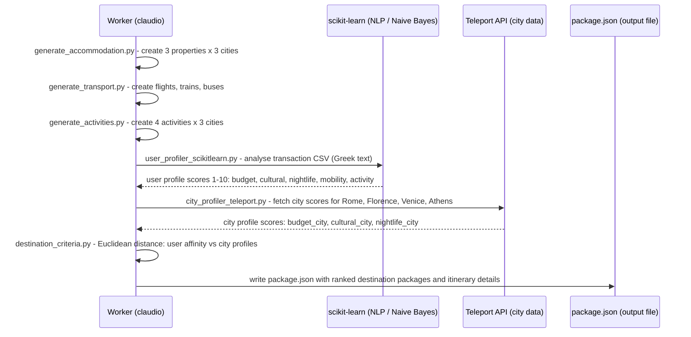

# TravelBudgetPlanner — Sequence Diagram

## Main Planning Flow

---

## Worker Pipeline (Offline — runs before the service starts)

---

## Error / Fallback Paths

| Scenario | Behaviour |
|----------|-----------|
| Gemini API fails on `/prompt` | HTTP 502 returned; UI shows error message |
| Gemini returns malformed JSON | Regex fallback extracts JSON from markdown block |
| Gemini date extraction fails | Secondary LLM call requests date correction |
| Gemini destination selection fails | All available destinations included in results |
| `/destPackage` GET fails | UI silently omits "Planned Trips" section |
